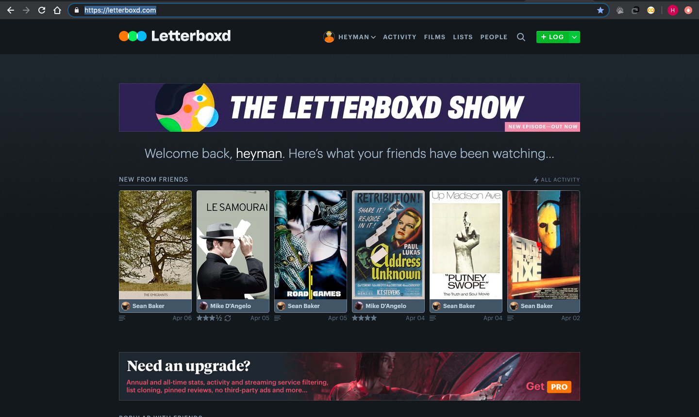

# Enhancing the User Experience 

### UCLA Digital Humanities 150 - Spring 2020

*Created by Hunter Harralson*

There are many websites I frequent based on personal interests. For many of these, there are details I notice that would make my experience as a user much smoother. With this project, I am looking to improve a website that I feel I would use more with minor improvements. 

---

## Case 1: <a href="http://letterboxd.com" target="_blank"> Letterboxd </a> :movie_camera:

A website that serves as a social platform for cinephiles, Letterboxd allows a user to log viewed films, leave lengthy film reviews, rate movies, and discuss movies with friends and strangers. It serves as a medium for people to interact about the movies they love, hate, or simply want to share with their following.

I have been a Letterboxd user for around a year now, but I do not use it as frequently as I would like to. I think that part of this is because of the user experience. If I want to view information about a film, I am more likely to go to IMDB because I am more familiar with using it. Letterboxd is a very overwhelming experience for a new user. While it is obvious that many user experience principles have been thoughtfully considered, more minute details that aggregate throughout the experience can make it frustrating for a user like myself who desires the engagement the platform offers. 

---

# Heurisitc Evaluation

**1. Visibility of system status**: providing nuggets of information (feedback) that allow users to accurately assess the current state of the system.

* Letterboxd is pretty good about this - when one hovers over the like button or the stars to rate, the system responds with highlighting the feature. It tells you with a green bar when the rating was recorded. It does not, however, tell you where you are in relation to the overall system - say you clicked a film from a friend’s favorite film list, there is nothing indicating that the previous page you were on was your friend’s profile, specifically in favorite films. It is very easy to get lost and have no clue how to navigate back to the page you were just on - or even remember what it was. I also feel that when you log a film, it should respond by showing the list where the film has been added to expand, or highlight, or anything that leads me to where this rating/log is stored. After I log a film it feels as if I have to go on an extensive search to find it. On the activity page, i feel that it should have a way of telling the user when new activity is there, like how twitter has with its timeline. 

**2. Match between system and the real world**: the system should speak to the user’s real world, via language, phrases, and concepts that are familiar.

* I feel that the dialogue may be too simple, such that it is ambiguous. For example, on the activity page, the three options are ‘stream’,’you’, and ‘incoming’. For me, I can assume ‘stream’ is like a timeline, but ‘you’ is very confusing. I think it should say ‘your activity’ to specify more, and I still have no clue what ‘incoming’ means. The tab on my page has never showed anything. Icons to match the text may be helpful for this too. 
* One of the main pages is just called ‘People’, which lists critics and famous people using the site actively - a cool concept. However, I feel like there could be a better word for this. I don’t feel like ‘People’ makes much sense. It may also be more fitting to have ‘Friends’ there and another tab for the famous people.
* Furthermore, a key component of the site is rating films from 0 to 5 stars, with increments in half stars. However, a common problem I have when using the site is that I often find myself tediously counting the stars. Like, “Is that 3.5 or 4 stars??” Perhaps color coding the stars on a spectrum from red to green would be helpful for the user to get a sense of a rating with a quick look. 

**3. User control and freedom**: if a user makes a mistake, they should be able to go back to the previous page or homepage easily without having to take many steps.

* They are good about this, except for the lack of being able to see where a rated film goes (already mentioned). So, if I mistakenly log a film, I have to laborously navigate to find it to fix a mistake. 

**4. Consistency and standards**: the same actions should remain the same throughout an app/website via using the same words and icons; internal and external consistency need to be maintained.
* no tengo nada por ahora 

**5. Error prevention**: notifying and offering users a way out of an error that may be made.

* While there aren't too many instances in which a user can make an error, especially with grave consequences, Letterboxd does account for the one error that would make me rip my head off - accidentally deleting a well-thought out review while typing it. 
* “Are you sure you want to abandon this review?”

**6. Recognition rather than recall**: users need more context-provided cues to make something a recognition process and not a taxing recall process.

* Major problema - touched on this earlier

**7. Flexibility and efficiency of use**: an action can be carried out in a number of different ways, with efficiency potentially increasing for a more experienced user; user can choose their method of interaction.

* Flexibility to create a new list with the green icon up top 
* Can rate films without having to click on it - just hover 

**8. Aesthetic and minimalist design**: remove unnecessary elements as they only compete with the essential information; reduce the noise to increase the signal.

* I think this is a big issue - the home page is a jumbled mess with teasers for everything instead of just being a directory that is simple. 
* There may be too many options and that is what makes the experience overwhelming until one is very familiar with the website. 
* The activity stream feels unnatural and very cluttered. It doesn’t do a very good job of separating reviews from other comments and logs - it feels like the other activity is linked to the reviews in some way, when they are unrelated. 

**9. Help users recognize, diagnose, and recover from errors**: error messages should concisely and clearly indicate the error and how the user can fix it.

* Good with this
* Maybe for the search feature it could suggest how to improve a search if nothing comes up 

**10. Help and Documentation**: allow users to find their problem, and then list concrete steps that they can carry out to solve the issue. 

* The Help page may be the best page aesthetically on the website as well as serving a great function. I wish it was more visible for me as a relatively new user. It tells one how to navigate the website and its features, as well as listing shortcut actions. However, unlike many good help pages, it does not have a search feature for specific issues - it just gives specific insights to the website. 
