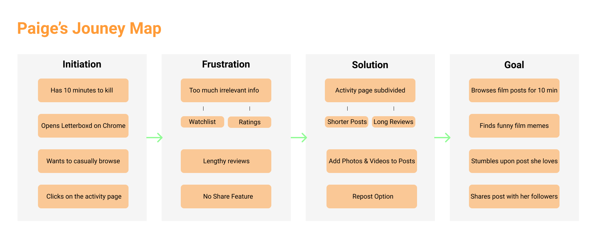

# DH150 - Assignment 05 - Personas and Scenarios
## <a href="http://letterboxd.com" target="_blank"> Letterboxd </a> :movie_camera:
*Created by Hunter Harralson*

---

&nbsp;

## Digital Storytelling:
The importance of UX storytelling lies in the ability of one to put themselves in the shoes of the user.
The first step is creating different prototypes of users based on user research. In creating differing perspectives, more pain points can be discovered and improved upon.
By imagining a user's journey from start to finish, fluid features and pain points become apparent, allowing a desinger to greatly improve the product.

&nbsp;

## Improving Letterboxd
After years of experience with Letterboxd as well as user research in the prior assingments, I have identified three features of the film platform's website to improve upon.
* **1. The Activity Feed**
* **2. The Profile Page**
* **3. Messaging** (this is not present, but I feel that its implementation would be useful)

---

&nbsp;

## Persona Creation and Empathy Maps

### **Proto Persona 1: Paige**

  

&nbsp;

### **Paige's Empathy Map**

  

---

&nbsp;

### **Proto Persona 2: Scott**

  

&nbsp;

### **Scott's Empathy Map**

  

---

&nbsp;

### **Proto Persona 3: Sean**

  

&nbsp;

### **Sean's Empathy Map**

  

---

&nbsp;

## User Scenarios and Journey Maps

### **1. Paige's Scenario:**
* 
* 

&nbsp;

### **Paige's Journey**

  

---

&nbsp;

### **2. Scott's Scenario:**
* 
* 

&nbsp;

### **Scott's Journey**

  

---

&nbsp;

### **3. Sean's Scenario:**
* 
* 

&nbsp;

### **Sean's Journey**

  

