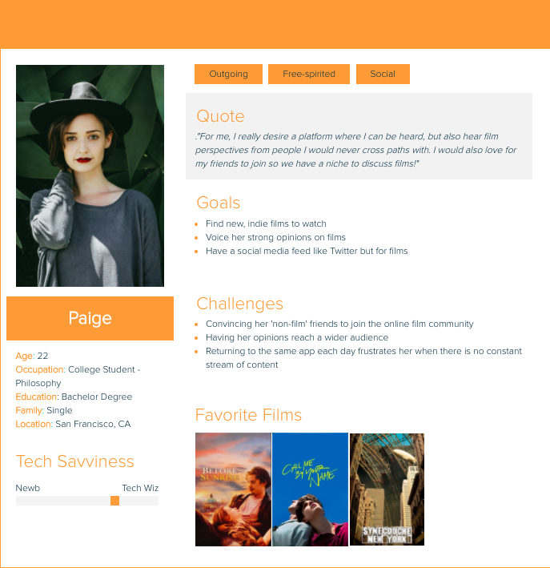

# DH150 - Assignment 05 - Personas and Scenarios
## <a href="http://letterboxd.com" target="_blank"> Letterboxd </a> :movie_camera:
*Created by Hunter Harralson*

---

&nbsp;

## Digital Storytelling:
The importance of UX storytelling lies in the ability of one to put themselves in the shoes of the user.
The first step is creating different prototypes of users based on user research. In creating differing perspectives, more pain points can be discovered and improved upon.
By imagining a user's journey from start to finish, fluid features and pain points become apparent, allowing a desinger to greatly improve the product.

&nbsp;

## Improving Letterboxd
After years of experience with Letterboxd as well as user research in the prior assingments, I have identified three features of the film platform's website to improve upon.
* **1. The Activity Feed**
* **2. The Profile Page**
* **3. Messaging** (this is not present, but I feel that its implementation would be useful)

---

&nbsp;

## Persona Creation and Empathy Maps

### **Proto Persona 1: Paige**

  

&nbsp;

### **Paige's Empathy Map**

  

---

&nbsp;

### **Proto Persona 2: Scott**

  

&nbsp;

### **Scott's Empathy Map**

  

---

&nbsp;

### **Proto Persona 3: Sean**

  

&nbsp;

### **Sean's Empathy Map**

  

---

&nbsp;

## User Scenarios and Journey Maps

### **1. Paige's Scenario:**
* Paige has just 15 minutes until her next class starts. While sitting in a coffee shop on campus, she decides to turn to Letterboxd to kill the next 10 minutes checking out information on movies. She opens up her laptop with the hope of finding brief posts which both enlighten her and lighten her day up. With only 10 minutes to browse, she doesn’t want to start reading something too long or she might as well be finishing up her philosophy readings for the week. 
* Already a user, Paige opens up Letterboxd on her computer browswer, and is immediately brought to her home page, where she starts her journey. Paige immediately clicks on the Activity page, where she can see the activity of the people she follows in chronological order. She goes here because she does not have enough time to read any of the longer articles in the news section. Once on the activity page, she reads the first post: ‘Jeff1997 has added Spiderman 2 to his watchlist,’ and immediately thinks ‘I don’t give a damn about what Jeff may watch.’ She then scrolls past 3 near essays in the form of reviews from film critics she follows, thinking to herself ‘If only I had an hour...’ The next post under the reviews simply tells her that her friend Brenden has watched Twilight and rated it 4/5 stars. “Okay... that’s all he left,” she mumbles to herself, wondering what he possibly liked about it so much. Completely standing out below is a box nested in the activity that must be important, right? “Nope,” she thinks, as she reads the box saying that a critic has replied to a minor comment from one of his earlier reviews. Somehow overcoming that distracting box, she finally sees a post she both agrees with and finds funny. A guy from her high school watched an Indie film she loves called American Honey and rated it 5 stars. He also left a funny comment about Shia LaBeouf’s eyebrow ring, which made Paige giggle. Wanting to share this post with her followers, Paige looks for a way to repost her acquaintence’s post, but can't seem to find such a feature. 
* Luckily for Paige, the activity page is subdivided into ‘Reviews’ and ‘Posts’, which is a new section that allows a user to post a thought about a film by identifying the film and leaving a short remark about it. The user can also embed a video to their post or a photo. This allows the humor already present on Letterboxd to have its own section along with the shorter thoughts. Furthermore, Paige discovers that there is a Share feature for both reviews and posts, so now her posts have the potential to be shared with a broader audience AND she will see new reviews and posts on her feed.
* After she find a few funny posts and hot takes on films in an efficient and unfrustrating way, Piage packs up her laptop and heads to class with the feeling that she did not waste the last 10 minutes searching for information.

&nbsp;

  

---

&nbsp;

### **2. Scott's Scenario:**
* 
* 

&nbsp;

  

---

&nbsp;

### **3. Sean's Scenario:**
* 
* 

&nbsp;

  

