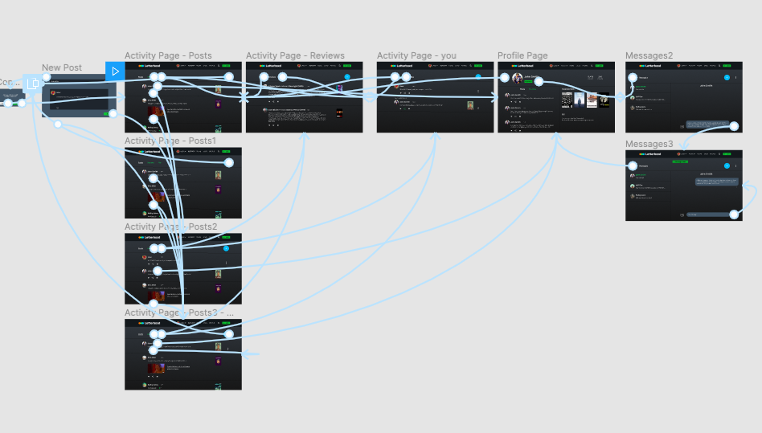

# DH150 High-Fidelity Prototype - Letterboxd
*Created by Hunter Harralson*

### Description of Project
My project is based on the website <a href="http://letterboxd.com" target="_blank"> Letterboxd </a>, which is a social platform for people who regularly watch and keep up with films. As my friends and myself often use the website, we have discussed the minute flaws that lead up to a lessened experience, so when the time came to choose a project, this seemed like the right choice.

Through user research, I was able to identify a few features that could greatly improve the social experience of being a Letterboxd user. Primarily, the activity page stands out as overcrowded and difficult to navigate. For a platform aimed at being social, my interviewee from the usability testing phase noted that he often avoids the activity page because of its cluttered state. He mentioned that giving formal film reviews their own section separate from shorter posts about films would give him a greater sense of control over the content he sees. 

The high fidelity prototype stage was very exciting for me, as I was able to transfer my low fidelity wireframes into something functional. Initially, the process was very useful for me as the designer to see features I may have overlooked in my wireframe creation. More importantly, the end prototype’s functionality allows one to perform user testing on the product to further improve it. With more feedback comes more iteration, thus leading to a more effective product. For the high fidelity prototype, I took my wireframes into Figma to demonstrate three major user scenarios: 

1. Browse shorter posts from the activity page and share one of these posts.
2. Create a post and view this post on the activity page.
3. Navigate from the activity page to a user’s profile, and send the user a personal message.

### Graphic Design
The graphic design of Letterboxd does not feel very flawed at all. The color scheme is fairly neutral with a lot of grays and some inclusion of the color green for actions. I decided to stick to this theme, as I feel it gives the website a relaxed but professional feel. 

#### Activity Page with Separation of Posts and Reviews
For users to better navigate the now-clustered activity page, I implemented three different tabs for the activity page. In order to navigate these three tabs, I included a top tab menu that reflects the user’s system status by highlighting the current tab. I also included a large blue button for new posts or reviews. The reason I chose this color was for a couple of reasons. First, I did not want the button to be confused with the green ‘Log’ button in the menu. Next, I chose the color of blue directly from Letterboxd’s logo because I feel that it adds a bit more informality to the activity page, hopefully making it feel more fun. Another major decision came with the placement of the film cover connected to the post. Currently, on Letterboxd, the cover appears on the left side of the review next to the user’s profile picture, but I feel that it interferes with the ease of the user to navigate and read posts. I wanted to include the film covers, which I think are less distracting on the right side. 

#### Simplified User Profile Page
According to my usability test results, the user profile page was difficult to navigate and my interviewee noticed its overcrowdedness. Furthermore, to reflect the simplified activity page, I created the same top tab menu on the profile page for a user’s posts and reviews. Most importantly, in my opinion, is the inclusion of the message icon so that a user can send personal messages to other users from their profile. I chose to place this next to the following button because those are the two major actions one can do from the profile page.

#### Messages
The screen below is the messages page. On the screen, the user is in the process of messaging John Smith. For this page, the main thing I focused on was giving the user visibility of the system status. The current recipient’s name is green, and there is a ‘new message’ field in both the text bar and on the other user’s tab. Furthermore, after the message is sent, there is a ‘Message sent’ confirmation at the top of the screen as well as a checkmark below the previously sent message to confirm delivery.

### Impression Test and Cognitive Walkthrough
For the impression test and cognitive walkthrough, I asked a friend who has never seen or used Letterboxd to give his opinion. He was able to quickly spot that the website was related to film reviews, and after asking the types of tasks he thinks one could accomplish, he listed many of the core features of the activity page that made it social in nature. However, he mentioned one feature I completely abandoned in my design: replying to posts via comments. A big eye-opener for me, this shows the strengths of prototyping and the iterative process, as I will now go back and incorporate comments in the design of the next iteration. I found it funny when I asked one word to describe the website, which he described as ‘neutral’, the same way I happened to describe the color scheme in the graphic design section. 

For the cognitive walkthrough, I combined two of the tasks from the user scenarios so that I could assess more screens of the prototype. I described a user that finds a post, shares it, then decides to write a new post, and finally wants to see the posts listed together. I walked my interviewee through the chosen user scenario and asked his feedback along the way. This stage actually went very smoothly: he knew what to click in each situation and did not feel any confusion during the process. A suggestion that I will improve upon was the lack of more system feedback following the sharing of a post. The interviewee stated the change of color of the share icon was not enough. 

Find the link to my impression test and cognitive walkthrough <a href="https://docs.google.com/document/d/1S35tT5ZqR4UH7rlNTG6SOp_O1HYde7dLgaHGTGQCPSo/edit?usp=sharing" target="_blank"> here </a>

### Accessibility Check
For the accessibility check, I installed the suggested A11y Contrast Color Checker plugin for Figma to evaluate the contrast. Most of the components passed the evaluation, however, my initial choice to place white text over the green icons did not suffice. Therefore, I brightened up the green and changed the text to black. 

### Interactive Prototype
Find the link to my interactive prototype <a href="https://www.figma.com/proto/zEzM2ZRwq5pqiNeEJTn8V5/Letterboxd-Prototype?node-id=42%3A8&viewport=-3524%2C231%2C1.126181960105896&scaling=min-zoom" target="_blank"> here </a>

The following are the three user scenario tasks:
**Task 1: Share a post**
* Select “Posts” tab
* Click the Share icon under John Smith’s post

**Task 2: Create a new post**
* From the “Posts” tab, select the New Post icon (blue button at top right)
* Click the “Post” button on the new post overlay
* Click the “You” tab to view the post

**Task 3: Send a message**
* Select “Posts” tab
* Click on John Smith’s name to navigate to his profile
* Click the Message icon on his profile
* Send the typed message by pressing the green arrow send button

### Diagram of Wireflow
The first image represents the screen designs, and the second image displays the wireflows of the prototype. 

