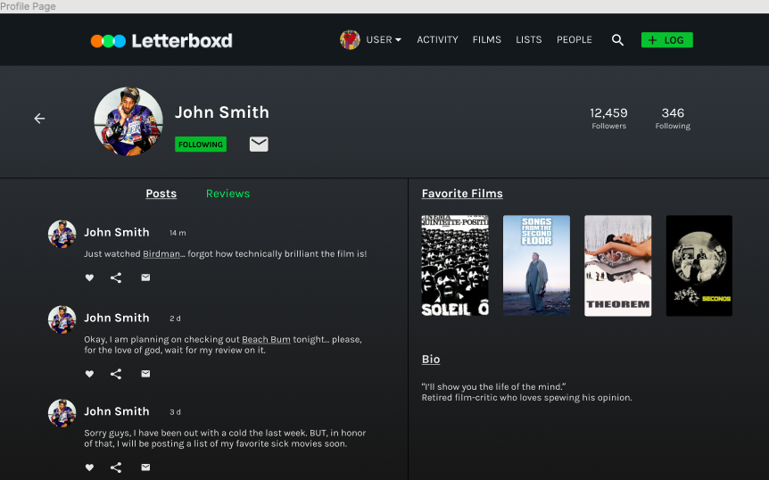
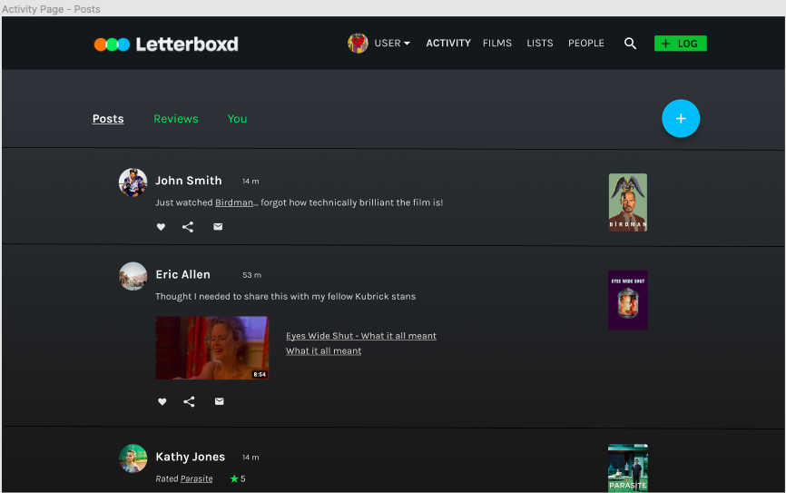
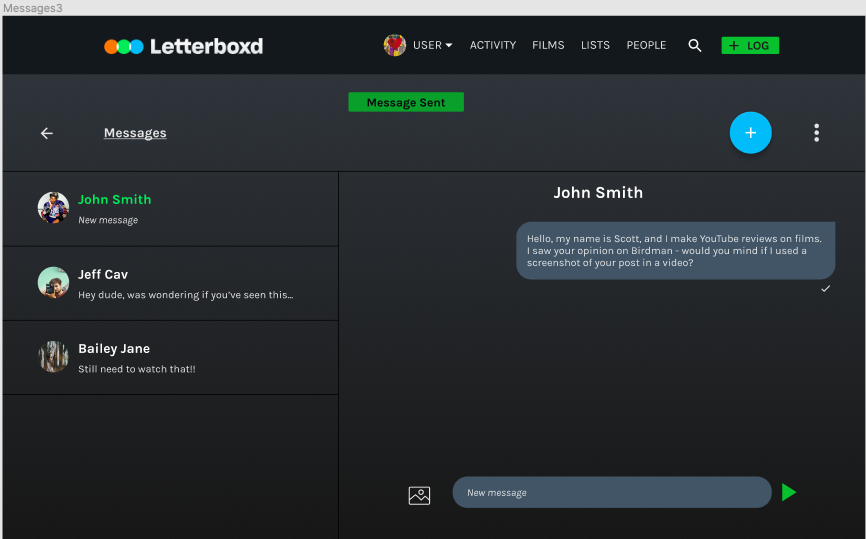

# Enhancing the social film experience
## By Hunter Harralson

### Introduction
In this project, I will present a novel UX design to enhance the social experience of being a user of the film website Letterboxd. A website that serves as a social platform for cinephiles, Letterboxd allows a user to log viewed films, leave lengthy film reviews, rate movies, and discuss movies with friends and strangers. It serves as a medium for people to interact about the movies they love, hate, or simply want to share with their following. Users are driven to the website for the purpose of socializing about the specific topic of cinema; however, following analysis and user research, the social experience of Letterboxd does not seem to fulfill its potential.  

### Design Statement
My project is focused on providing film lovers an equally enriched social experience as they receive on other social media platforms. The social facet of Letterboxd fulfills a person’s need for belonging to a community, and through sharing films and opinions, one can feel they truly belong to a community. Having a niche platform like Letterboxd creates a community of users who all come to the site/app for similar reasons. Thus, the main target for a redesign was the activity page of Letterboxd, which could be tweaked in a few ways to greatly increase its fluidity. 

### Heuristic Evaluation
At the beginning of this project, I conducted a heuristic evaluation of the Letterboxd website and found a few areas that could use some improvement. Mainly, the organization of the website was a problem. At many points, it seems as if there is too much information presented and the information is not easily distinguishable. Therefore, it seemed difficult to navigate the website with confidence and ease. The system feedback lacked in providing the user with a sense of ease while exploring the website. 
[... Read More >>>](https://github.com/hunterharralson/DH150-UX/blob/master/README.md)

### Usability Testing
Usability Testing is a method to evaluate how a given website or application is interacted with by its users. In testing how a user completes routine tasks, the user-centered design can be greatly improved. A usability test is conducted with a group of potential users in three typical settings: a usability lab, remotely, or on-site using portable equipment. These sessions are recorded, with their data analyzed to help identify potential improvements to the website or application.
I conducted a usability test of the website Letterboxd, using a live version of the website while testing my roommate remotely.
[... Read More >>>](https://github.com/hunterharralson/DH150-UX/tree/master/assignment02)

### User Research
To gain a deeper perspective of user opinions of the Letterboxd experience, I conducted a contextual interview with a different interviewee. I feel that the best way of understanding the user is by simply asking them about their experience and viewing this experience live.
[... Read More >>>](https://github.com/hunterharralson/DH150-UX/tree/master/assignment04)

### User Storytelling
The importance of UX storytelling lies in the ability of one to put themselves in the shoes of the user. The first step is creating different prototypes of users based on user research. In creating differing perspectives, more pain points can be discovered and improved upon. By imagining a user's journey from start to finish, fluid features and pain points become apparent, allowing a designer to greatly improve the product. For this project, I created three proto-personas along with user scenarios to deepen my empathy for potential users of Letterboxd. 
[... Read More >>>](https://github.com/hunterharralson/DH150-UX/blob/master/assignment05/README.md)

### Low-fidelity prototype
The purpose of the low fidelity prototype is for me to simply visualize ideas and be able to test the usability of these implementations in a low-cost setting where I can easily apply fixes later. Ideally, by the end of this stage of development, there will be a base structure that can be turned into a high-fidelity prototype. In creating and testing these prototypes, it is determined whether or not a product is usable. 
The features represented in this prototype are features that, through research and usability testing, were deemed useful additions in improving the social aspect of Letterboxd. The first feature is the inclusion of an activity page that is separated based on reviews and posts, thus allowing more informal posts about films. Then there is the personal messaging option between users, something that would increase the sharing of information. And finally, there is an improved user profile page that includes a button to message and the display of posts and reviews in a timeline fashion.
[... Read More >>>](https://github.com/hunterharralson/DH150-UX/tree/master/assignment06)

### High-fidelity prototype
My high-fidelity prototype was created through Figma and was a way to turn my wireflows into an interactive and testable prototype. Initially, the process was very useful for me as the designer to see features I may have overlooked in my wireframe creation. More importantly, the end prototype’s functionality allows one to perform user testing on the product to further improve it. With more feedback comes more iteration, thus leading to a more effective product. For the high fidelity prototype, I took my wireframes into Figma to demonstrate three major user scenarios:
1. Browse shorter posts from the activity page and share one of these posts.
2. Create a post and view this post on the activity page.
3. Navigate from the activity page to a user’s profile, and send the user a personal message.
[... Read More >>>](https://github.com/hunterharralson/DH150-UX/tree/master/assignment07)
Find the link to my interactive prototype <a href="https://www.figma.com/proto/zEzM2ZRwq5pqiNeEJTn8V5/Letterboxd-Prototype?node-id=42%3A8&viewport=-3524%2C231%2C1.126181960105896&scaling=min-zoom" target="_blank"> here </a>

  

    
  

  

    
  

  

    
  

### Evaluation of prototype
Furthermore, I have conducted an impression test, cognitive walkthrough, and accessibilty test of my high fidelity prototype. I asked a friend who has never seen or used Letterboxd to give his opinion. He was able to quickly spot that the website was related to film reviews, and after asking the types of tasks he thinks one could accomplish, he listed many of the core features of the activity page that made it social in nature.
[... Read More >>>](https://github.com/hunterharralson/DH150-UX/tree/master/assignment07)

### Pitch Video 

### What I have gained from this experience

